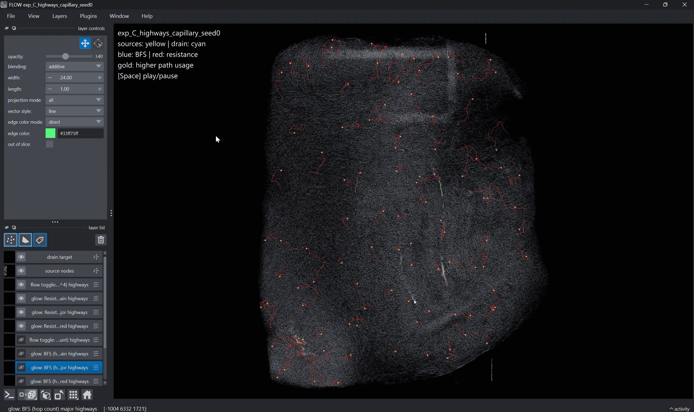
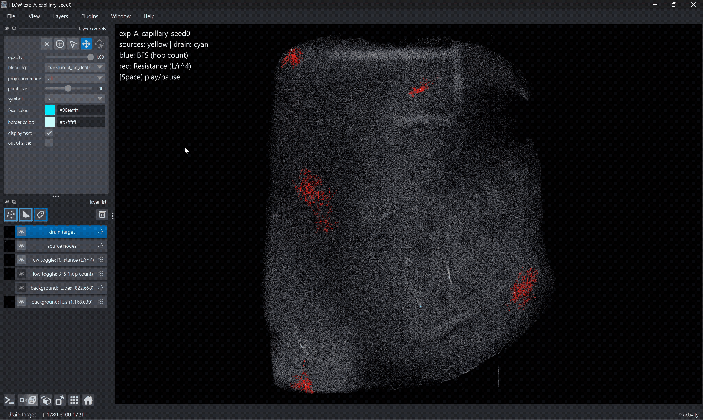
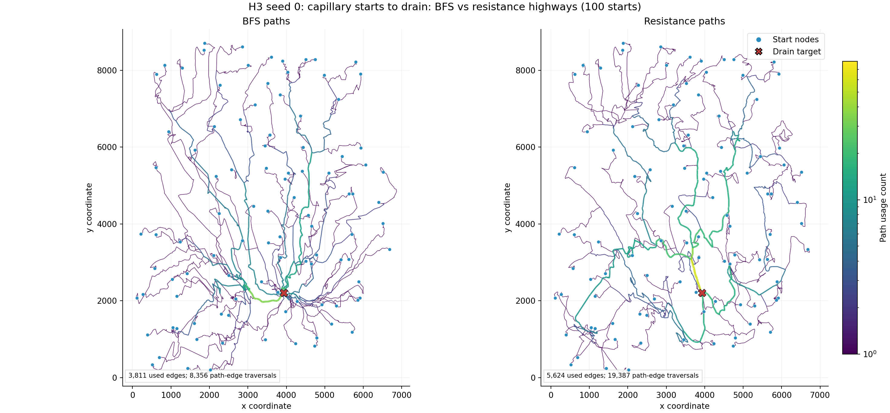
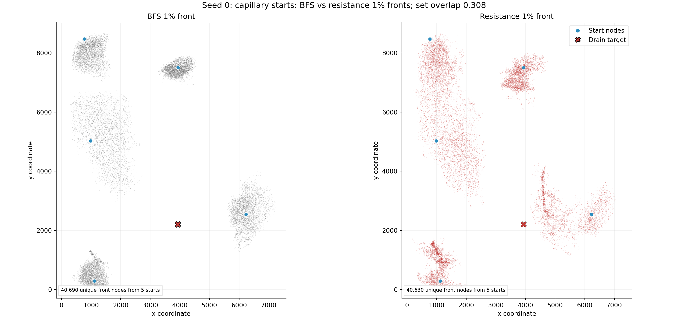

# FLOW

Conducted at the **Department of Artificial Intelligence in Biomedical Engineering (AIBE), Friedrich-Alexander-Universität Erlangen-Nürnberg**.

FLOW compares shortest-path fronts and source-to-drain routes on 3-D vascular graphs. The study tests how topology, vessel length, and vessel radius change early fronts and edge usage.

## Hypotheses

| ID | Hypothesis | Primary metric |
|---|---|---|
| H1 | Including vessel radius changes shortest-path fronts compared with topology- and length-based routing. | 1% front overlap with BFS |
| H2 | Vessel radius affects resistance-weighted routes more than vessel length. | Resistance overlap with radius-only and BFS fronts |
| H3 | Topology-based and resistance-weighted routing produce different source-to-drain highways. | Weighted and set Jaccard of edge usage |

## Stored results

| Dataset | Nodes | H1 resistance/BFS | H2 resistance/radius | H3 weighted Jaccard |
|---|---:|---:|---:|---:|
| `HC1.5_gurobi` | 7,506,802 | 0.306 | 0.743 | 0.025 |
| `HC1.5_clearmap` | 822,658 | 0.450 | 0.752 | 0.034 |

Front values average 25 source-level comparisons. Highway values average three seeded runs with 100 sources per run. Full statistics and figures are stored under `experiments/<graph-name>/`.

## Visualizations

### 3-D Highway Route Animation (Featured)
*Source-to-drain highway routes comparing fluid resistance-weighted routing against topological baseline (BFS).*


*Figure: Source-to-drain highways generated by resistance-weighted routing, highlighting primary flow channels in gold.*

---

### 3-D Shortest-Path Front Propagation
*Front expansion through the 3D vascular graph.*


*Figure: 3-D front propagation comparison across capillary sources.*

---

### 2D Spatial Maps & Highway Heatmaps

#### Highway Edge Usage Heatmap


#### Capillary Front Distribution Map


## Setup

Python 3.11 or newer is required.

Windows PowerShell:

```powershell
git clone https://github.com/dipesh-m/FLOW.git
cd FLOW
python -m venv .venv
.venv\Scripts\Activate.ps1
python -m pip install -r requirements.txt
```

macOS or Linux:

```bash
git clone https://github.com/dipesh-m/FLOW.git
cd FLOW
python3 -m venv .venv
source .venv/bin/activate
python -m pip install -r requirements.txt
```

## Graph data

Download `data.zip` from [Google Drive](https://drive.google.com/drive/folders/1cyFxu5LTmuX3N6EWKnaZU6H7_eBX0QTS?usp=sharing), extract it, and place these files in the repository:

```text
data/HC1.5_gurobi.gml
data/HC1.5_clearmap.gml
```

The first graph load creates a `.gml.pkl` cache beside the graph file. Graph files and caches are excluded from Git.

## Run the study

Each graph writes to its own directory. A new graph named `data/example.gml` writes to `experiments/example/`.

Gurobi graph:

```powershell
python src/run_all.py --graph data/HC1.5_gurobi.gml
python src/analyse.py --graph data/HC1.5_gurobi.gml
```

ClearMap graph:

```powershell
python src/run_all.py --graph data/HC1.5_clearmap.gml
python src/analyse.py --graph data/HC1.5_clearmap.gml
```

Run one configuration:

```powershell
python src/run_all.py --graph data/HC1.5_clearmap.gml --only exp_A_capillary_seed42
```

The committed results can be analysed without rerunning the experiments:

```powershell
python src/analyse.py --graph data/HC1.5_gurobi.gml
python src/analyse.py --graph data/HC1.5_clearmap.gml
```

## 3-D visualization

Napari requires OpenGL support. Front runs accept any subset of `bfs`, `length`, `resistance`, and `radius`. Highway runs compare BFS with resistance as defined by H3.

Gurobi graph:

```powershell
python src/visualize.py exp_A_capillary_seed0 --graph data/HC1.5_gurobi.gml --methods bfs resistance
python src/visualize.py exp_C_highways_capillary_seed0 --graph data/HC1.5_gurobi.gml
```

ClearMap graph:

```powershell
python src/visualize.py exp_A_capillary_seed0 --graph data/HC1.5_clearmap.gml --methods bfs resistance
python src/visualize.py exp_C_highways_capillary_seed0 --graph data/HC1.5_clearmap.gml
```

Press Space to pause or resume the animation. On limited graphics hardware, sample the background graph:

```powershell
python src/visualize.py exp_A_capillary_seed0 --graph data/HC1.5_clearmap.gml --methods bfs resistance --vessel-edges sample --vessel-nodes sample
```

## Tests

```powershell
python -m unittest discover -s tests -v
```

## Repository layout

```text
configs/                         experiment definitions
data/                            local graph files and caches
docs/study.md                    hypotheses, methods, results, and conclusions
docs/architecture.md             pipeline architecture and component roles
docs/media/                      visualizations and animations
experiments/<graph-name>/        run outputs, analysis, and figures
src/                             experiment, analysis, and visualization code
tests/                           unit tests
experiments.csv                  experiment registry
```

See the [study](docs/study.md) for the experimental record and [architecture](docs/architecture.md) for the pipeline structure.

## Limitations

- FLOW uses graph-based path costs and does not simulate pressure, velocity, or fluid dynamics.
- Results depend on the supplied graph reconstructions and configured source and target rules.
- Seed replicates describe variation across sampled sources; the study does not estimate population-level effects.
