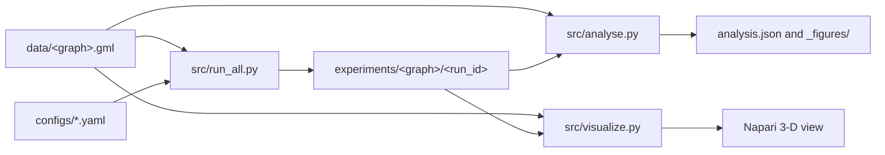

# Architecture

FLOW uses command-line entry points for experiment execution, analysis, and 3-D visualization. Each graph has an independent result directory.

## Components

| Component | Responsibility |
|---|---|
| `src/flow_experiment.py` | Graph loading, source and target selection, path calculations, metrics, and run outputs |
| `src/run_all.py` | Configuration discovery and experiment execution |
| `src/analyse.py` | Result aggregation, hypothesis summaries, and static figures |
| `src/visualize.py` | Napari layers and animated 3-D front or highway views |
| `configs/*.yaml` | Reproducible parameters for each run ID |
| `experiments.csv` | Experiment registry and scientific rationale |
| `experiments/<graph-name>/` | Stored run data, aggregate analysis, and figures |

## Data flow

`run_all.py` loads one graph, builds the shared edge and node arrays, and executes each selected YAML configuration. Front runs write per-source metrics and path summaries. Highway runs write per-edge usage counts for BFS and resistance.

`analyse.py` aggregates the stored run files within one graph-specific directory. `visualize.py` combines the same run summaries with the source graph to construct interactive 3-D layers.
