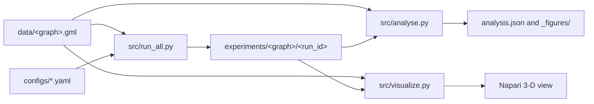

# Methodology

## Study design

FLOW compares shortest paths on a fixed vascular graph under four edge costs. Front experiments measure the first 1% of reachable nodes. Highway experiments count edge use across paths from sampled sources to one drain target.



## Input graphs

| Graph | Nodes | Edges | Largest connected component |
|---|---:|---:|---:|
| `HC1.5_gurobi.gml` | 7,506,802 | 7,832,373 | 7,453,213 |
| `HC1.5_clearmap.gml` | 822,658 | 1,168,039 | 813,874 |

Each node supplies a 3-D coordinate, radius, and vessel type. Each edge radius is the mean of its endpoint radii. The implementation clamps the radius to `1e-6` before applying inverse fourth-power costs.

## Edge costs

| Method | Edge cost | Role |
|---|---:|---|
| BFS | `1` | Topology baseline |
| Length | `L` | Physical-distance control |
| Resistance | `L / r^4` | Radius-aware path proxy |
| Radius | `1 / r^4` | Resistance ablation without length |

The resistance cost is a graph proxy based on the single-tube Hagen-Poiseuille relation. The study does not simulate fluid dynamics.

## Sources and target

Capillary runs draw a seeded random pool from capillary nodes in the largest connected component, then apply greedy k-center selection in 3-D. Artery control runs sample artery nodes with a seeded uniform draw.

All runs use the largest-radius vein in the largest connected component as the drain target.

## Experiment groups

| Group | Runs | Sources per run | Purpose |
|---|---:|---:|---|
| A, capillary fronts | 5 seeds | 5 | H1 and H2 |
| B, artery fronts | 5 seeds | 5 | Source-type control |
| C, capillary highways | 3 seeds | 100 | H3 |
| C, artery highways | 3 seeds | 100 | Source-type control |

## Metrics

The front for one source and method contains the 1% closest reachable nodes. H1 compares each front with BFS. H2 compares the resistance front with the radius-only front.

Highway experiments count how many source-to-target paths use each edge. H3 reports:

```text
weighted_jaccard = sum(min(usage_bfs, usage_resistance))
                   / sum(max(usage_bfs, usage_resistance))

set_jaccard = |used_bfs intersection used_resistance|
              / |used_bfs union used_resistance|
```

## Output schema

```text
experiments/<graph-name>/
|-- analysis.json
|-- _figures/
`-- <run_id>/
    |-- config.yaml
    |-- summary.json or highways_summary.json
    |-- metrics.csv and paths.csv
    `-- highways_bfs.csv and highways_resistance.csv
```

Front runs produce `metrics.csv`, `paths.csv`, `graph_summary.csv`, and `summary.json`. Highway runs produce one edge-usage CSV per method and `highways_summary.json`. Files that do not apply to a run type are absent.
